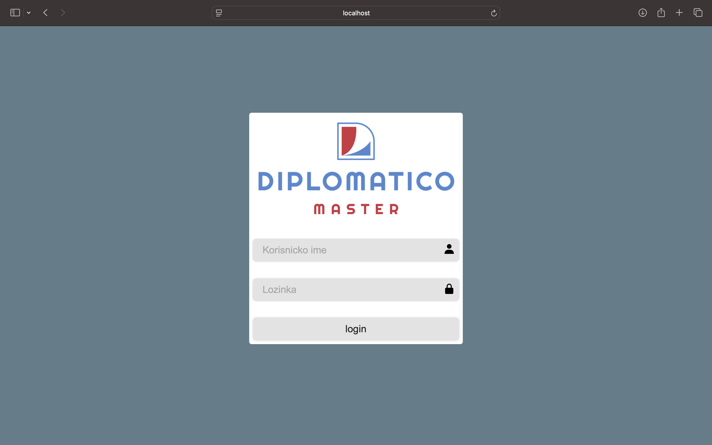
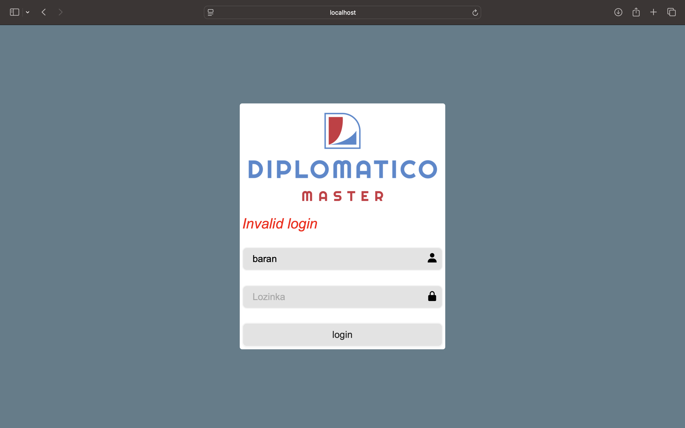
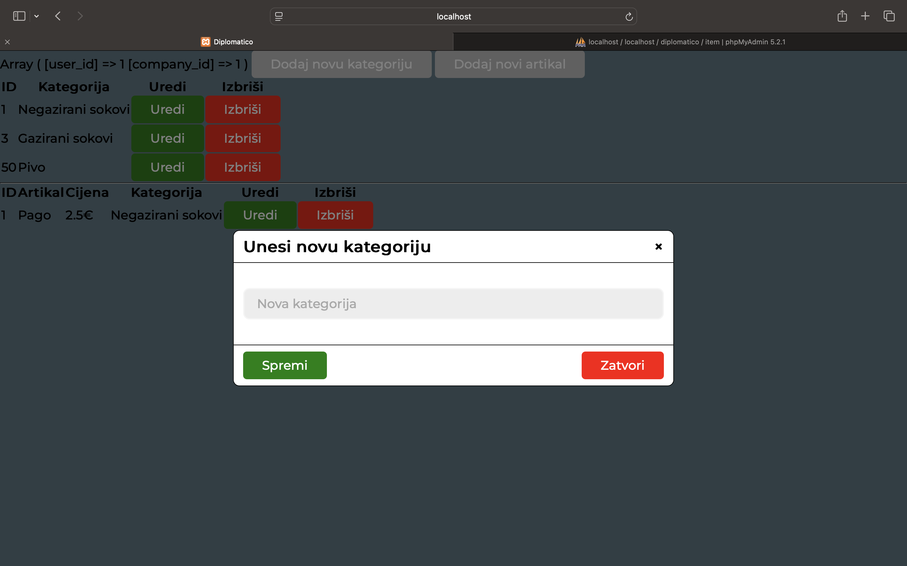
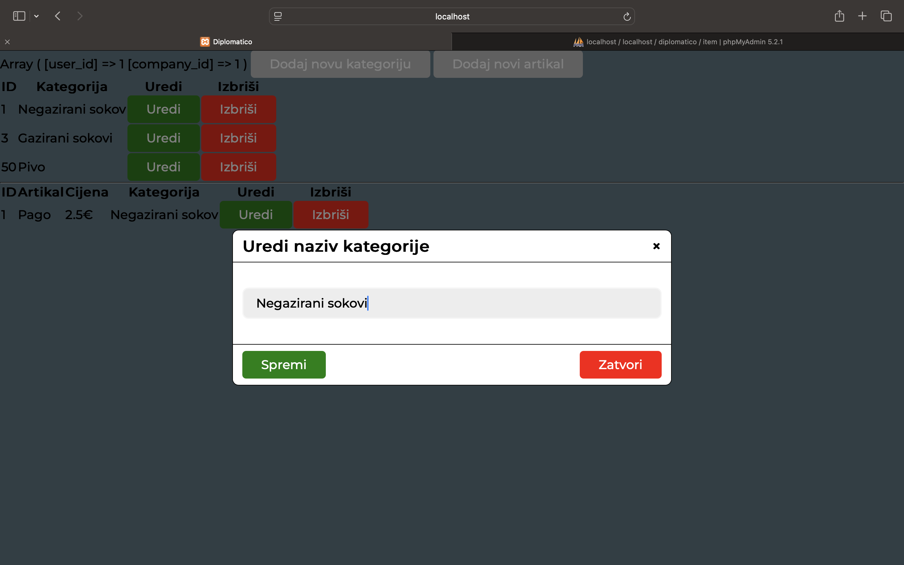
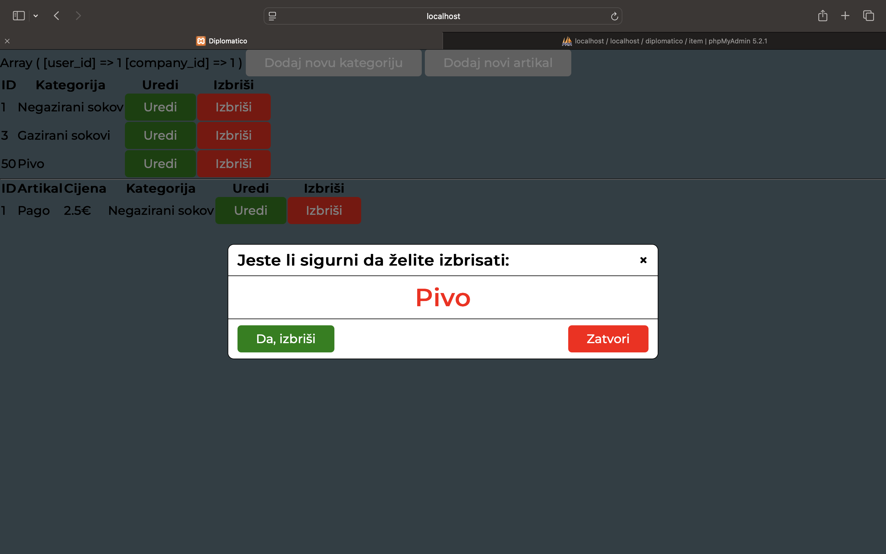
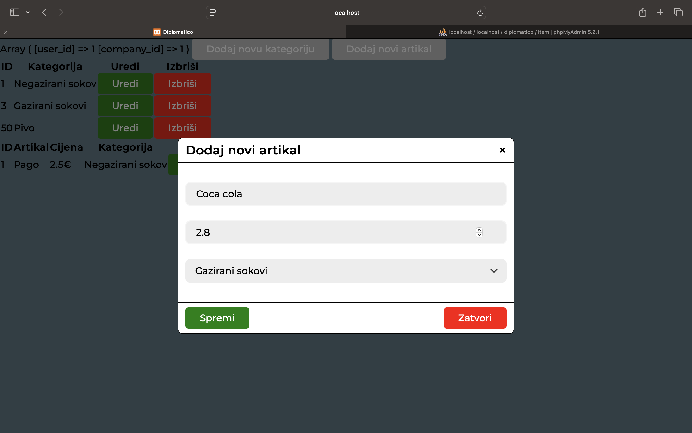
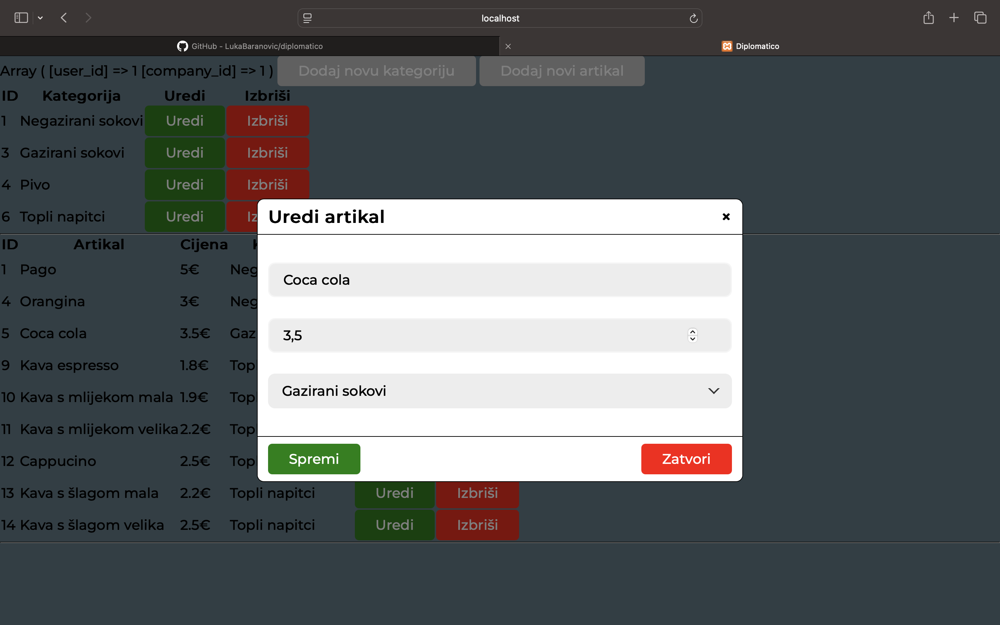
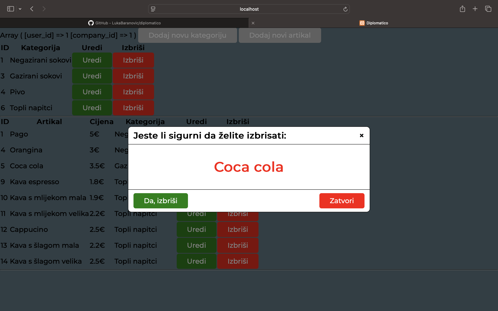

# diplomatico

  1. Korak

Izrada stranice za login, username i password se dobiva od admina/vlasnika programa Diplomatico Master.
Fotografija izgleda stranice za prijavu korisnika. 

Prilikom pogrešne prijave dobivamo poruku 'invalid login' crvene boje. Pamti se korisničko ime, a lozinka ne. 

#

  2. Korak

  Izrada index.php (home page) stranice koja ima sve CRUD funkcije. 

  To će bit glavna stranica gdje će korisnik moći koristiti sve CRUD funkcije za kategorije i artikle. 
  Korisnik preko ovoga dodaje kategorije i artikle i tako slaže ponudu.
  

